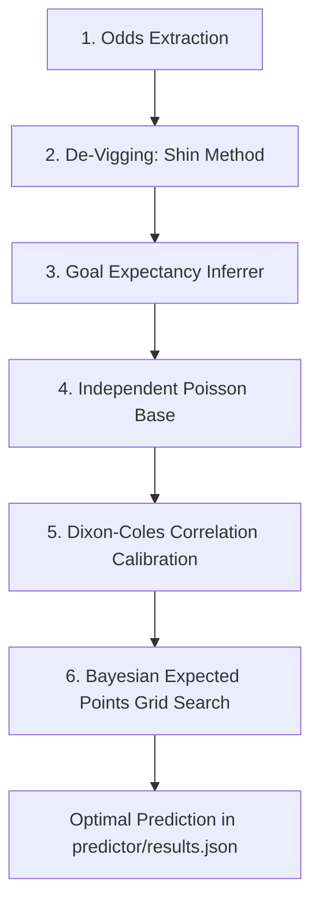

# 🏆 FIFA World Cup 2026: Market Odds-Based Score Predictor

This repository implements a highly sophisticated, premium-grade predictive system to forecast scorelines for the remaining matches of the FIFA World Cup 2026. The model utilizes real-time market consensus data, mathematical bookmaker margin elimination (De-Vigging), tactical goal expectancy modeling (Dixon-Coles), and a Bayesian decision-theoretic optimizer to maximize tournament bracket points.

---

## 📂 Project Directory Structure

The repository is structured cleanly and modularly:

*   **`predictor/` (Modeling Core)**:
    *   `predictor/main.py`: Main prediction pipeline (fetches odds, de-vigs, computes Dixon-Coles expected goals, and runs expected points grid search).
    *   `predictor/results.json`: Output database containing calculated probability metrics and optimal predictions for all upcoming matches.
*   **`scheduler/` (Automation & Precision)**:
    *   `scheduler/create_crons.py`: Script to batch-program 70 individual precision cron triggers on `cron-job.org`.
    *   `scheduler/fifa-world-cup-2026-UTC.csv`: Official World Cup match schedule with timestamps in UTC.
*   **Root Folder**:
    *   `app.py`: Interactive Streamlit dashboard to visualize predictions, goal expectancies, and probabilities.
    *   `requirements.txt`: Python package dependencies.
    *   `.env`: Local environment configurations (containing API and webhook keys, ignored by Git).
    *   `.gitignore`: Defines files ignored by Git tracking (e.g., `.env`, local virtual environments).

---

## 📊 Mathematical Modeling Pipeline

The model does not rely on subjective opinions or biased historical stats. Instead, it leverages the **wisdom of the crowds** from global betting markets, refined through a six-stage mathematical pipeline:



### 1. Market Odds Extraction
The system fetches decimal head-to-head (1X2) odds from **The Odds API**. Financial betting markets serve as highly efficient aggregators of real-time variables (team form, injury updates, climate, and tactical shifts).

### 2. Market Margin Removal (De-Vigging) via Shin's Method
Bookmakers price outcomes with a profit commission margin (*overround*), meaning the implied probabilities sum to $> 1.0$ (typically $1.05 - 1.10$). Rather than using simple multiplicative normalization (which incorrectly assumes the margin is added proportionally across all outcomes), this model employs **Shin's Method (1993)**.
* **Core Hypothesis**: The betting market consists of a fraction $z$ of "informed traders" (who possess perfect information about the true outcome) and a fraction $1-z$ of "uninformed traders" (noise bettors).
* **Formula**: To avoid arbitrage opportunities, the bookmaker sets the implied probability $\pi_i$ for outcome $i$ to satisfy:
  $$\pi_i = (1-z)p_i + z\sqrt{p_i}$$
  An optimization solver (via the `penaltyblog` library) solves for $z$ (the proportion of informed trading) and the **true probabilities** $p_{Home}$, $p_{Draw}$, and $p_{Away}$ such that their sum equals exactly $1.0$.

### 3. Goal Expectancy Parameter Inversion ($\lambda_H$, $\lambda_A$)
Using the clean probabilities $p_{Home}$, $p_{Draw}$, and $p_{Away}$, the system solves for the underlying goal expectancy parameters—$\lambda_H$ (Home Expected Goals) and $\lambda_A$ (Away Expected Goals). This step translates win/draw/loss probabilities into raw offensive and defensive performance intensities.

### 4. Base Independent Poisson Distribution
As a baseline, the number of goals scored by the Home team ($X$) and Away team ($Y$) are modeled as independent Poisson random variables:
$$P(X = x) = \frac{\lambda_H^x e^{-\lambda_H}}{x!}, \quad P(Y = y) = \frac{\lambda_A^y e^{-\lambda_A}}{y!}$$
The joint probability of a specific scoreline $(x, y)$ is calculated as the product of their individual probabilities:
$$P(X=x, Y=y) = P(X=x) \times P(Y=y)$$

### 5. Dixon-Coles Low-Scoring Correlation Calibration
In real-world football, goal outcomes are not completely independent. There is a statistically significant correlation that produces more low-scoring draws (0-0, 1-1) and fewer low-scoring asymmetric wins (1-0, 0-1) than predicted by independent Poisson distributions.
To correct for this, we apply the **Dixon and Coles Model (1997)** with an international tournament adjustment factor $\rho$ (calibrated to $-0.13$):
$$P_{DC}(X=x, Y=y) = \tau(x, y) \times P(X=x) \times P(Y=y)$$
where the scaling factor $\tau(x, y)$ is defined as:
$$\tau(x,y) = \begin{cases} 
1 - \lambda_H \lambda_A \rho & \text{if } (x,y) = (0,0) \\
1 + \lambda_A \rho & \text{if } (x,y) = (1,0) \\
1 + \lambda_H \rho & \text{if } (x,y) = (0,1) \\
1 - \rho & \text{if } (x,y) = (1,1) \\
1 & \text{otherwise}
\end{cases}$$
This step yields a fully calibrated, normalized $6 \times 6$ probability matrix representing the joint likelihoods of scorelines up to 5 goals.

### 6. Bayesian Expected Points Grid Search
Predicting the single most likely scoreline (the statistical mode of the matrix) is mathematically suboptimal if you want to win a tournament. Your prediction strategy must align with the point structure of your competition:
*   **Correct Outcome (Winner/Draw) (1X2)**: **5 points**
*   **Correct Home Goals**: **2 points**
*   **Correct Away Goals**: **2 points**
*   **Correct Goal Difference**: **1 point**

Let $P_{pred} = (p_h, p_a)$ be your score prediction and $A = (a_h, a_a)$ be the actual scoreline. The points awarded for your prediction given the actual result is $S(P_{pred}, A)$.
The expected points $\mathbb{E}[\text{Points}]$ for a prediction $(p_h, p_a)$ is calculated as:
$$\mathbb{E}[\text{Points}(p_h, p_a)] = \sum_{a_h=0}^{5} \sum_{a_a=0}^{5} P_{DC}(a_h, a_a) \times S\Big((p_h, p_a), (a_h, a_a)\Big)$$
The system executes a discrete grid search over all $(p_h, p_a) \in \{0, 1, 2, 3, 4, 5\}^2$ and selects the prediction that **maximizes this expected value**.

---

## 🛠️ Step-by-Step Configuration Guide

Follow these steps to deploy the prediction pipeline, automate calculations, and display results in real time.

### 1. Account Setup
Make sure you have active accounts on:
1. **GitHub**: To host your code repository and run the background workflow runner.
2. **The Odds API**: Retrieve a free API Key from [the-odds-api.com](https://the-odds-api.com/).
3. **cron-job.org**: Set up a free account on [cron-job.org](https://cron-job.org/) to handle the kickoff triggers.
4. **Streamlit Community Cloud**: Connect your account at [share.streamlit.io](https://share.streamlit.io/) to publish the dashboard.

---

### 2. Repository Secrets & Local Settings

#### A. Configure GitHub Repository Secrets
To run the automated model calculations securely in the cloud without exposing keys:
1. Navigate to your GitHub repository.
2. Go to **Settings > Secrets and variables > Actions**.
3. Create a **New repository secret**:
   * **Name**: `THE_ODDS_API_KEY` | **Value**: Your API key from The Odds API.
4. Go to **Settings > Actions > General > Workflow permissions**, select **Read and write permissions**, and click **Save** (this allows the background Action to save the updated `predictor/results.json` directly to your repository).

#### B. Generate a GitHub Personal Access Token (PAT)
To enable the external scheduler (`cron-job.org`) to trigger your GitHub Actions workflow precisely 45 minutes before kickoff, you must provide it with a token:
1. On GitHub, go to your profile: **Settings > Developer Settings > Personal Access Tokens > Tokens (classic)**.
2. Generate a new token with **`repo`** (full control) and **`workflow`** permissions.
3. Copy the token.

#### C. Configure your Local `.env` File
Create a `.env` file in the root directory of your project (which is ignored by Git via `.gitignore`) and insert your credentials:
```env
# API Key for cron-job.org (to authenticate create_crons.py)
CRON_JOB_API_KEY=your_cron_job_api_key_here

# GitHub Personal Access Token (to allow cron-job.org to authenticate with GitHub)
GITHUB_PAT=your_github_personal_access_token_here
```

---

### 3. Automated Scheduling with cron-job.org
The scheduler script creates 70 individual cron tasks to trigger predictions dynamically before kickoff.

1. Install project dependencies in your local Python environment:
   ```bash
   pip install -r requirements.txt
   ```
2. Execute the scheduler creation script:
   ```bash
   python scheduler/create_crons.py
   ```
The script parses the World Cup schedule in [scheduler/fifa-world-cup-2026-UTC.csv](file:///scheduler/fifa-world-cup-2026-UTC.csv), subtracts 45 minutes from each match kickoff time, and hits the cron-job.org API to set up the jobs.
* Each job triggers an authenticated **HTTP POST** to your GitHub Actions dispatch endpoint:
  * **URL**: `https://api.github.com/repos/camilo-chile/worldcup-predictor/actions/workflows/predict_games.yml/dispatches`
  * **Headers**: Includes your `GITHUB_PAT` as a Bearer token.
  * **Payload**: `{"ref": "main"}`

---

### 4. Streamlit Dashboard Deployment
Publish the UI to display the calculated predictions:
1. Go to [Streamlit Share](https://share.streamlit.io/) and click **Create app**.
2. Select your repository (`camilo-chile/worldcup-predictor`), branch (`main`), and set the entry file to `app.py`.
3. Click **Deploy**.
4. The dashboard will now automatically load and show predictions directly from `predictor/results.json`.

---

## 🏃 Testing and Manual Runs

* **Cloud Automation**: Once configured, cron-job.org automatically runs the model 45 minutes before each match, updating results on the dashboard.
* **Manual Local Execution**: To test calculations or refresh predictions locally:
  1. Add `THE_ODDS_API_KEY=your_key` to your local `.env` file.
  2. Run the script:
     ```bash
     python predictor/main.py
     ```
  This creates/updates `predictor/results.json` locally.
